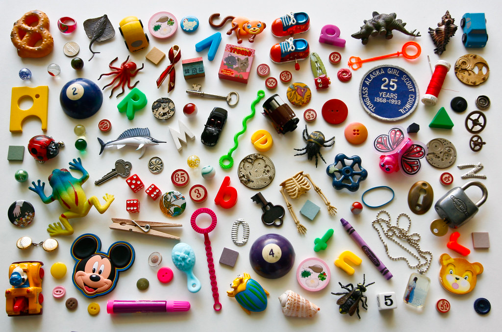
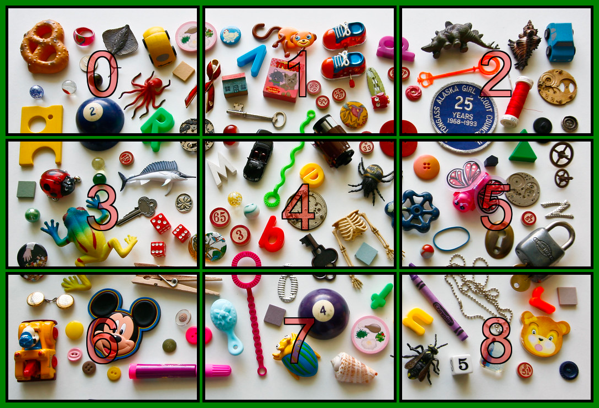
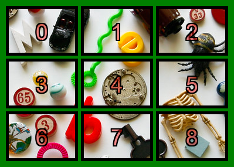

# ChatGPT Vision To Coords
Is a way to send ChatGPT vision a image broken into 9 sections, where it can then classify objects into those sections. Once a section or sections are identified, it will take those sections again and redivide them to obtain better precision.

## Example

User: "I spy with my little eye something that is spooky"

Assistant: "I've identified section 4 as having a skeleton in it"

User: "With this image of section 4 where is the skeleton?"

Assistant: "Section 5"

## How it works:
1. The image is broken into 9 sections with a green background and black outline around each section.
2. The resulting image is sent to ChatGPT Vision to be processed. 
3. Once a response is received, function calling is used to extract the sections that were identified.
4. The identified sections are then broken into 9 sections and sent again.
5. The process repeats to the point where no more sections can be identified or the image is too small to be broken into 9 sections.
## How it use
1. Git clone 'https://github.com/nickandbro/chatGPT_Vision_To_Coords' and pip install requirements.txt
2. Insert API key into config.py.
3. Open up main.py and change the image path to the image you want to use then run.
## Problems
-Some objects that make up multiple sections have a hard time being correctly identified.
-When subdividing a section again, the loss or resolution leads to a decrease in performance of the model. 
-Sometimes chatGPT functions do not properly pickup the mentioned sections 

